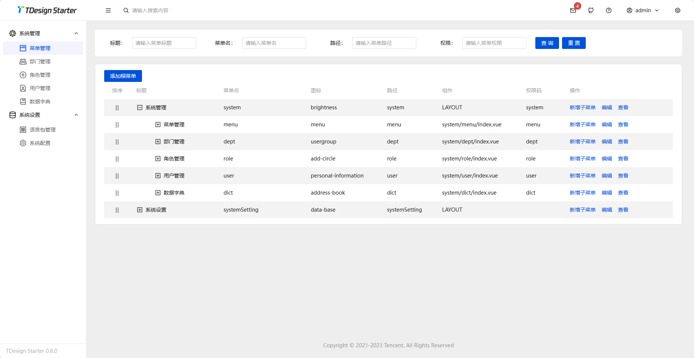

<h1 align="center" style="margin: 30px 0 30px; font-weight: bold;">Poem-Solon v0.1.0</h1>
<h4 align="center">以solon + mybatis-flex + satoken为基础的脚手架,用于快速开发项目,基于satoken实现了RBAC权限模型的分布式架构</h4>

目前系统仍在开发中,所以不提供演示地址,欢迎贡献代码
### 系统简介

1. 基于MIT协议完整开源
2. 前端采用tdesign模板适配
3. 前端技术栈:vue3 + vite + pina
4. 后端技术栈:solon + mybaits-flex + satoken + damiBus
5. 数据库使用postgresql,redis
6. jdk支持默认21,可低成本兼容到17

### 技术选型
 **为什么使用[solon](http://solon.noear.org/)**: solon是一款国产的生态框架同时兼容jdk8、jdk11、jdk17、jdk20,相比springboot拥有更小的包体积，更小的内存占用，更快的启动速度,目前jar文件大小仅13M左右

 **为什么使用[mybaitis-flex](https://mybatis-flex.com/)**: 采用APT技术而不是反射而拥有了更强大的性能,使用QueryWrap无sql模式更加得心应手,可以轻易的迁移至其他数据库

 **什么是damiBus**: damiBus是一款是专为本地多模块之间通讯解耦而设计,通过他可以让模块间高度解耦
 
 **为什么使用pgsql**: 开源免费,社区强大,性能卓越,通过schema能够低成本的完成saas

### 安装教程

1.  部署数据库运行sql脚本
2.  根据需求选择引入redis或者使用单体
3.  前端运行npm install ,npm run dev运行
4.  后端修改main中的配置文件即可直接运行

### 页面展示

### 参与贡献

1.  Fork 本仓库
2.  新建 Feat_xxx 分支
3.  提交代码
4.  新建 Pull Request
